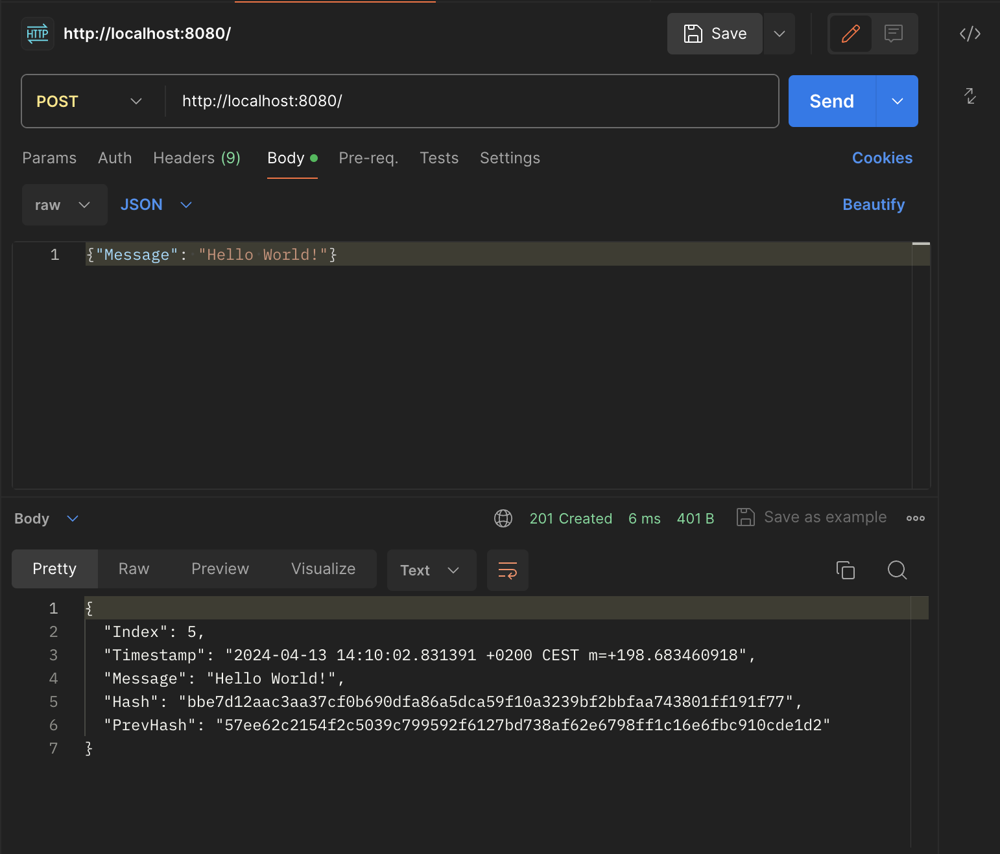

# Simple Blockchain

Implementation of a simple blockchain implementation in Go.

## Tree

```bash
simple-blockchain/
│
├── blockchain.go    # Contains the definitions of the Block structure and functions related to the blockchain, such as hash calculation and block generation.
├── main.go          # Entry point of the program. Contains the main logic of the program, including initialization of the blockchain and the web server.
├── server.go        # Contains functions related to the web server, such as setting up the HTTP router and route handlers.
└── utils.go         # Contains common utility functions used throughout the project, such as JSON serialization.
```

## Installation

1. Clone this repository:

    ```bash
    git clone https://github.com/your_username/simple-blockchain.git
    cd simple-blockchain
    ```

2. Run the `make install` command to compile the program and ensure all dependencies are up to date.

    ```bash
    make install
    ```

## Usage

Once installed, you can run the program with the `make run` command:

```bash
make run
```

This will compile the program and execute it. After running, you can interact with the blockchain through a web interface.

To add a new block to the blockchain, you can send a POST request to the endpoint with the block data in the request body. For example:

```bash
curl -X POST -H "Content-Type: application/json" -d '{"Message": "Hello World!"}' http://localhost:8080
```

Or using Postman:


